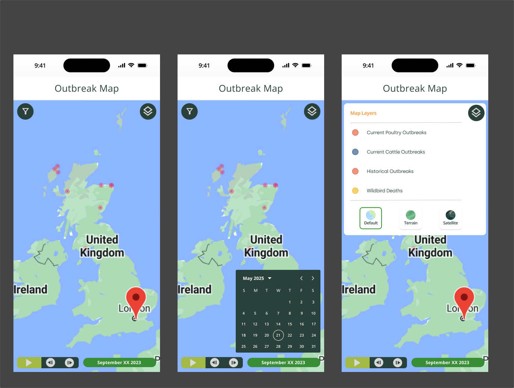
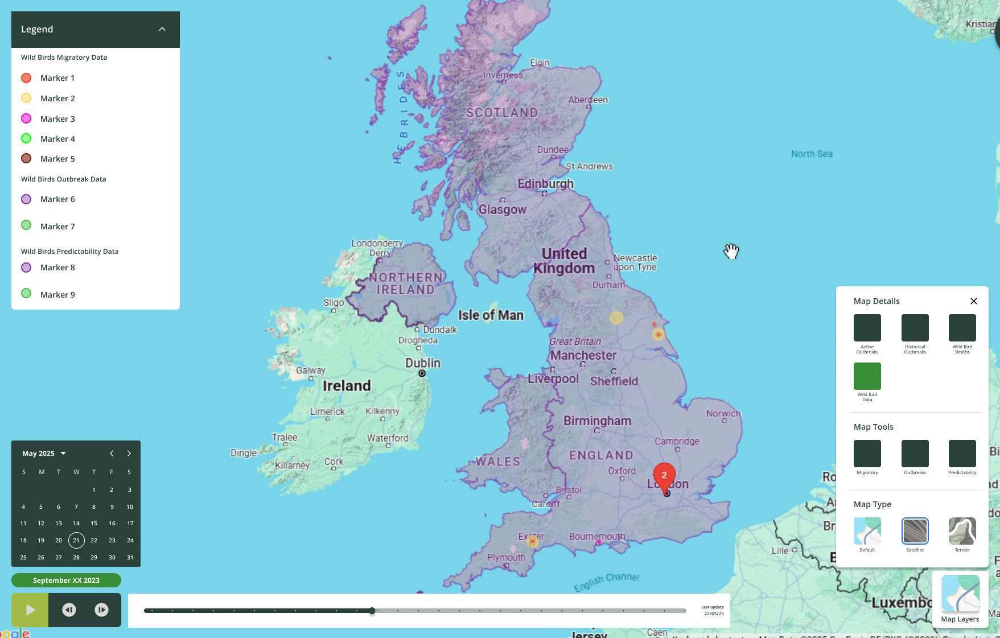

# Livetec FE Engineering Assessment

## Overview

This project serves as a basic scaffold for Livetec's FE engineering interview assessment. It contains JSON datasets for farms, avian influenza outbreaks and wildbird tracking, along with starter applications in React and Flutter.

## Getting Started

1. Clone this repository
2. Review the project structure below
3. Set up the `example-api` to serve the data (see `example-api/README.md`)
4. Complete the assessment tasks for either flutter or react, or do both.

## Assessment Tasks

Using **either Flutter or React** implement the following features:

### Required Features

1. **Data Integration**
   - Connect to the `example-api` endpoints to fetch farm, outbreak and wildbird data
   - Display the data on the Google Maps component with appropriate shapes (circles, polygons, polylines) and markers

2. **Data Filtering**
   - Add UI controls (date pickers or input fields) for selecting a date range or other filters
   - Filter the displayed data using the API's query parameters
   - Update the map markers based on the selected filters

3. **Interactive Map Features**
   - Implement a layer toggle/control system to show or hide different data sets (farms, outbreaks, wildbird data) independently
   - Display different marker types/colors for different data categories (e.g., active outbreaks vs. wildbird deaths)
   - Show relevant information (info-window) when a marker is clicked (e.g., outbreak details, species, dates)
   - Display outbreak zones as appropriately sized shapes (e.g. circles or polygons) where applicable
   - Add a self-incrementing date slider that automatically advances through the date range, updating the map data in real-time

### Bonus Features (Optional)

- Error handling and loading states
- Add a data summary panel showing counts by category or risk level
- Implement clustering for dense marker groups
- Add additional filtering by disease type, species, or risk level
- Responsive design improvements
- Unit or integration tests

### Submission Guidelines

- Ensure your code is well-organized and follows best practices for your chosen framework
- Include comments for complex logic
- Update the relevant README (`flutter/README.md` or `react/README.md`) with:
  - Any additional dependencies you added
  - Setup instructions specific to your implementation
  - Notes on design decisions or trade-offs
- Provide a link to a git repository or submit a zip file containing your code (include your git commit history)

## Additional Information
### Mockups

A basic mockup to illustrate some of the requirements, use your creativity to refine and improve the UI/UX

#### Flutter

#### React

## Project Structure

### `data/`
Contains JSON datasets for farm locations, avian influenza outbreaks, wildbird deaths, and migration patterns:
- `farms.json` — Farm locations with coordinates, and classification
- `active-outbreaks.json` — Currently active disease outbreak zones
- `historical-outbreaks.json` — Historical outbreak records with start/end dates
- `wildbird-deaths.json` — Wildbird mortality events with location and species data
- `wildbird-migrations.json` — Wildbird migration tracking data with start/end locations and datesstatus

### `example-api/`
Basic Express.js REST API serving the JSON data from the `data/` folder. Supports optional date range filtering on all endpoints using `from` and `to` query parameters. See `example-api/README.md` for setup and usage.

**Note:** This is a basic API provided solely to facilitate the assessment process. You are **not** expected to modify, improve, or fix the API code unless doing so is strictly necessary to support new functionality you implement in the React or Flutter applications. The focus of this assessment is on frontend development and integration—not on API development or enhancement.

### `flutter/`
Flutter mobile application with a Google Maps widget. Configured for both Android and iOS with location permissions and Google Maps SDK integration. See `flutter/README.md` for setup instructions and API key configuration.

**Note:** A temporary Google Maps API Key and android signing keystore have already been configured to help simplify the setup

### `react/`
React single-page application (Vite) with a header, sidebar menu, and Google Maps component using the JavaScript SDK. Requires a `VITE_GOOGLE_MAPS_API_KEY` environment variable. See `react/README.md` for setup and run instructions.

**Note:** A temporary Google Maps API Key has already been configured to help simplify the setup